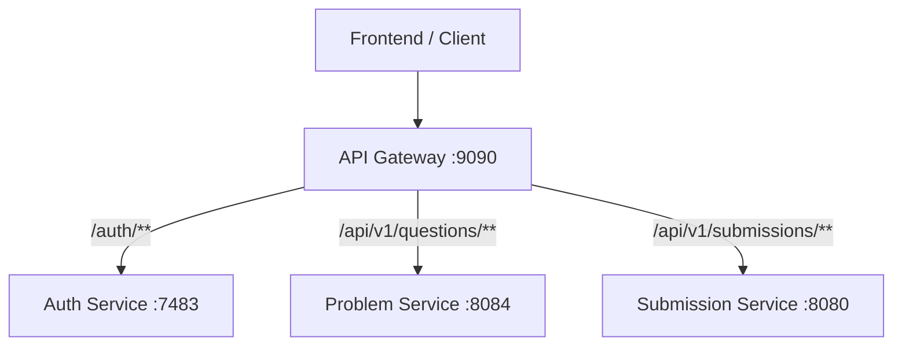

# AlgoCrack API Gateway

The **AlgoCrack API Gateway** is the central entry point for the AlgoCrack backend microservices architecture. It handles routing, authentication, and cross-cutting concerns for all incoming client requests.

## 🚀 Key Features

- **Single Entry Point**: Unified URL (`:9090`) for all backend services.
- **Security**: Centralized JWT validation using **RS256** asymmetric cryptography.
- **Routing**: Dynamic routing to:
    - Auth Service (`:7483`)
    - Problem Service (`:8084`)
    - Submission Service (`:8080`)
- **Reactive Stack**: Built on **Spring WebFlux** and **Netty** for high concurrency.
- **CORS**: centralized Cross-Origin Resource Sharing configuration.

## 🛠️ Tech Stack

- **Java 17**
- **Spring Boot 4.0.2**
- **Spring Cloud Gateway 5.0.1** (WebFlux)
- **Spring Security** (Reactive)
- **JJWT** (JSON Web Tokens)

## 🏗️ Architecture



## 🏃‍♂️ Getting Started

### Prerequisites
- JDK 17+
- Gradle 8.x
- Public Key (`public.pem`) in `src/main/resources/keys/`

### Installation

1.  **Clone the repository**:
    ```bash
    git clone https://github.com/your-repo/AlgoCrack-APIGateway.git
    cd AlgoCrack-APIGateway
    ```

2.  **Build the project**:
    ```bash
    ./gradlew clean build
    ```

3.  **Run the Gateway**:
    ```bash
    ./gradlew bootRun
    ```
    The Gateway will start on **port 9090**.

## 🔐 Authentication

All requests to `/api/v1/questions` and `/api/v1/submissions` are **protected**.
You must include a valid JWT in the `Authorization` header:

```http
Authorization: Bearer <your_jwt_token>
```

Get a token by signing in at `POST /api/v1/auth/signin`.

## 📚 Documentation

Detailed developer guides are available in the `context/` directory:
- [Frontend Integration Guide](context/frontend-guide.md)
